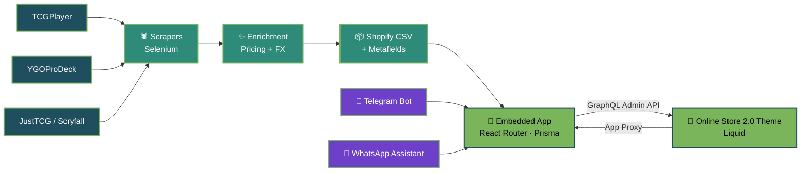

<div align="center">


<a href="https://github.com/bacan25">

</a>

<p>


</p>

<p>
<a href="mailto:gonzalezmiguel2000@gmail.com"></a>
<a href="https://www.linkedin.com/in/miguel-angel-gonzalez-76a179168"></a>

</p>

</div>

---

## 👨‍💻 About me

```yaml
name:      Miguel Angel Gonzalez Peña
role:      Shopify Developer · E-commerce Automation Engineer
based_in:  Medellín, Colombia
focus:     Liquid themes · Shopify apps · catalog automation
niche:     Trading card game (TCG) commerce
```

I build custom **Liquid** themes (Online Store 2.0), **embedded and extension-only Shopify apps**, and the automation behind large product catalogs: scraping, bulk imports, price updates, and API integrations.

Most of my work is in **TCG stores**, where catalogs have thousands of products and need a lot of automation. I also run a live store as webmaster and host my own backend services.

<table>
<tr>
<td width="50%" valign="top">

**🛍️ What I do**
- Custom Online Store 2.0 themes
- Embedded and extension-only Shopify apps
- Catalog, pricing, and inventory automation
- App Proxy integrations and webhooks

</td>
<td width="50%" valign="top">

**🤖 What I'm into**
- Multipurpose assistants on WhatsApp and Telegram
- Local LLMs with tool calling
- Turning manual catalog work into pipelines
- Teaching Python and programming logic

</td>
</tr>
</table>

---

## 🛠️ Tech Stack

<div align="center">

**🛍️ Shopify**


**⚙️ Backend & Data**


**🚢 DevOps & Integrations**


**🧠 AI, ML & Games**


</div>

---

## 🏗️ How I build a TCG store



---

## 🚀 What I've built

<details open>
<summary><b>🛍️ Shopify & E-commerce</b></summary>
<br>

| Project | What it is | Stack |
| :--- | :--- | :--- |
| **TCG Catalog Manager** 🔒 | Embedded Shopify app: bulk set import, card data enrichment, pricing, SEO, and inventory | `React Router` `Prisma` `GraphQL Admin API` `Railway` |
| **El Rincón del Duelista** 🔒 | Custom Online Store 2.0 theme with App Proxy sections, gamification, and 3D CSS effects | `Liquid` `JavaScript` `Shopify CLI` `GitHub Actions` |
| **Product Config App** 🔒 | Extension-only Shopify app and theme customization for a spirits store | `Shopify API` `Node.js` `App Extensions` |
| **Price Automation** 🔒 | Pulls prices from TCGPlayer and YGOProDeck into Airtable with a 4-level fallback and a **99.7% match rate** | `Python` `Airtable API` `SQLite` |
| **Catalog Pipelines** 🔒 | Scrapers that turn TCGPlayer, Scryfall, YGOProDeck, and JustTCG data into Shopify-ready CSVs with metafields and currency conversion | `Python` `Selenium` `pandas` |

</details>

<details open>
<summary><b>🤖 Automation, Bots & AI</b></summary>
<br>

| Project | What it is | Stack |
| :--- | :--- | :--- |
| **Multipurpose Assistants** 🔒 | Assistants built with **OpenClaw** that attend customers over WhatsApp and Telegram | `OpenClaw` `Python` `Meta Cloud API` |
| **Asistente del Rincón** 🔒 | Local-LLM business assistant with tool calling, wired into Shopify, WhatsApp, Telegram, Instagram, Gmail, and Google Sheets | `Python` `Ollama (llama3.1)` `Shopify API` |
| **RinconBot** 🔒 | Store chatbot backend: catalog search and live stock on Telegram, with a core ready for WhatsApp | `FastAPI` `PostgreSQL` `Redis` `Docker` `pytest` |
| **MotorCardCluster** 🔒 | Card data scraping engine with a scheduled job runner and a React dashboard | `FastAPI` `Selenium` `SQLAlchemy` `APScheduler` |
| **AI Investment Lab** 🔒 | Quantitative crypto trading engine with a deterministic risk engine, paper trading simulator, and a local RAG assistant | `Python` `Ollama` `pandas` |
| **ChambaGenerator** | Open-source AI job search framework built on Claude Code: evaluates postings, tailors CVs, writes cover letters | `Python` `Claude Code` |

</details>

<details open>
<summary><b>🧠 Machine Learning & Games</b></summary>
<br>

| Project | What it is | Stack |
| :--- | :--- | :--- |
| [**Netdecker-SupremIA**](https://github.com/bacan25/Netdecker-SupremIA) | Computer vision and ML to recognize and analyze Yu-Gi-Oh! decks | `TensorFlow` `Keras` `scikit-learn` `XGBoost` `PyGAD` |
| [**Al Ritmo de las Leyendas**](https://github.com/bacan25/al_ritmo_de_las_leyendas) | 2D music game with a custom audio-synced level engine. 🏆 **Winner of Premio Huellas 2023** | `Unity` `C#` |
| **CUTLAM** 🔒 | Multiplayer card game with a dedicated single-match server, built to scale on Unity Gaming Services | `Unity` `C#` `Networking` |

</details>

<br>

> 🔒 = private repository. Most of my professional work lives in private client repos, so the public ones here are personal and academic projects.

---

<div align="center">

### 📫 Let's talk

<a href="mailto:gonzalezmiguel2000@gmail.com"></a>
<a href="https://www.linkedin.com/in/miguel-angel-gonzalez-76a179168"></a>


</div>
